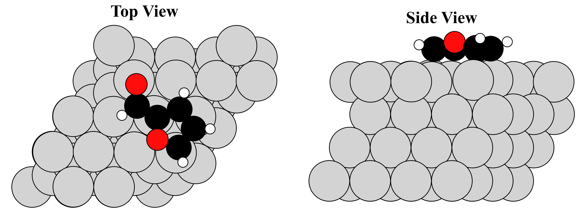
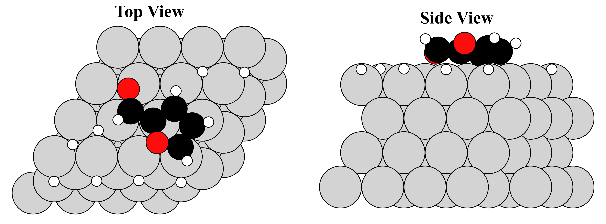

# StructurePlotting_ASE
A Python plotting utility using ASE to load VASP `POSCAR`/`CONTCAR` structures, optionally shift atomic positions, and generate top and side views of the structures.
**Version 1.0.0 (v1.0.0)** — current release.

# Overview
The code can:
* Locate `CONTCAR` or `POSCAR` files.
* Load structures using ASE.
* Optionally expand the periodic cell.
* Optionally shift structures in the x and/or y directions.
* Preview structures before applying a manual shift.
* Apply either a common or individual shift in case the adsorbates extend over the unit cell x,y dimension boundaries.
* Colour atoms according to their elements.
* Generate top and side views.
* Save the resulting figures as `.png` files.

# Folder and file access
The files should be located in folders relative to `main.py`. The code searches for `CONTCAR` and `POSCAR` files. If both are present in the same folder, `CONTCAR` is used.

## Shifting
Structures can optionally be shifted in the x and y directions.

The shift is based on the **maximum covalent diameter** of the atoms in the structure. This is calculated from the largest covalent radius present in the structure:
```text
maximum diameter = 2 × maximum covalent radius
```

The user enters integer multiples of this diameter. For example:
```text
x = -1
y = +1
```

means that the entire structure is shifted:
* one maximum atomic diameter to the left in x
* one maximum atomic diameter upwards in y

# Shift modes
When the program is run, the user selects one of three shifting options:

```text
1: SAME shift for ALL structures
2: MANUAL shift for EACH structure
3: NO shift to ANY structure
```

## Mode 1 — Same shift for all structures
I.e., That same x/y shift is then applied to every structure processed by the program. Only the first structure is previewed.

## Mode 2 — Manual shift for each structure
Each structure is individually previewed and a separate x/y shift can be specified.

## Mode 3 — No shift
No translation is applied to the structures.

# Colour coding
Atoms are coloured according to their chemical element. Specific colours can be defined in `main.py`. For example:

```python
element_colors = {
    "Ni": "lightgray",
    "C": "black"
}
```

Elements not explicitly assigned a colour use the ASE/Jmol default colours.

# Views
Two views are generated for each structure:
1. **Top View**
2. **Side View**

The top view uses:
```python
rotation="0x,0y,0z"
```

The side view uses:
```python
rotation="270x,0y,0z"
```

The figures are arranged horizontally by default.
The default figure size is:
```python
figsize = (12, 6)
```

and the default resolution is:
```python
dpi = 300
```

The titles use a font size of 24 and emboldened.

# Periodic cell expansion
Structures are loaded as one periodic unit cell:
```python
repeat = (1, 1, 1)
```

The repeat value can be changed in `main.py` if a larger periodic structure is required, such as:
```python
repeat = (2, 2, 1)
```

# Image saving
Figures are saved to the output directory specified in `main.py`.

The default output directory is:
```python
output_folder = "Figures"
```

The directory is automatically created if it does not already exist.

The program prints the output filename before saving, for example:

```text
Processing: system_1/CONTCAR
Output: Figures/system_1.png
Saved: Figures/system_1.png
```

# Inputs

## Mode selection

When the program starts, the user is asked to select a shift mode:

```text
Select shift mode:

1: SAME shift for ALL structures
2: MANUAL shift for EACH structure
3: NO shift to ANY structure

Enter mode (1/2/3):
```

The selected mode must be confirmed:

```text
Confirm mode 1? (y/n):
```

If an invalid value is entered, the program will ask again.

## Shifting inputs
For Modes 1 and 2, the program displays the structure before asking for the shift:

```text
Previewing structure.

Press Enter to close the figure...
```

The maximum covalent diameter is then displayed:

```text
Manual shift using max_radius = x.xxx Å
```

The user enters the x and y shift:

```text
Shift in x (multiples of diameter, negative = left, positive = right):
Shift in y (multiples of diameter, negative = down, positive = up):
```

The values must be integers.

# Python files
The code is separated into several files according to their purpose.

## `main.py`
Runs the overall workflow.

```python
main()
```

This file finds the structures, selects the shift mode, processes each structure and calls the plotting functions.

## `inputs.py`
Contains functions for collecting user input.

```python
get_int()
choose_shift_mode()
```

## `load.py`
Contains functions for locating and loading VASP structures.

```python
find_structure()
load_atoms()
```

## `shift.py`
Contains functions associated with shifting and previewing structures.

```python
max_radius()
view_cleanup()
build_shift()
apply_shift()
get_structure_shift()
```

## `plotting.py`
Contains functions for assigning atomic colours and generating the final figures.

```python
get_atom_colors()
plot_surface_views()
```

# Example
See examples under the "Figures" and "Systems" folders. Two example figures are provided below.


<p align="center">
  <em>Figure 1: Example figure of furfural adsorbed on Ni(111).</em>
</p>


<p align="center">
  <em>Figure 1: Example figure of furfural adsorbed on Ni(111) alongside other H atoms.</em>
</p>

# Requirements

The code requires Python and the following packages:
* ASE
* NumPy
* Matplotlib

These can be installed using:
```bash
pip install ase numpy matplotlib
```

The structures must be in a VASP-compatible `POSCAR` or `CONTCAR` format.
